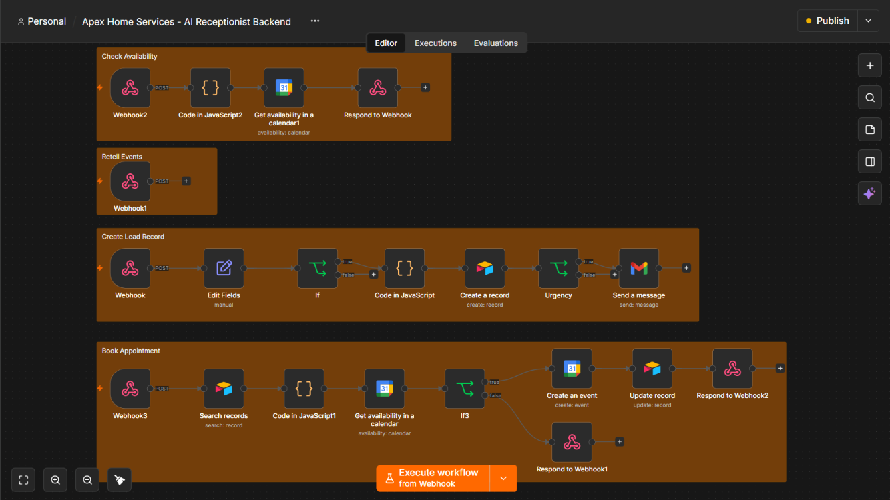

# Apex AI Voice Agent

An AI-powered voice receptionist and appointment booking system built for a home services business.

## Overview

Apex AI Voice Agent handles inbound customer calls, collects lead information, identifies the requested service and urgency, checks appointment availability, and books confirmed appointments automatically.

The system connects Retell AI with n8n to orchestrate the workflow, Airtable to store and update lead records, and Google Calendar to manage appointment scheduling.

## What the System Does

- Handles inbound customer conversations through an AI voice agent
- Collects customer name, phone number, service type, problem description, and urgency
- Determines whether the customer wants to schedule an appointment
- Checks calendar availability before booking
- Prevents appointments from being booked without customer confirmation
- Creates confirmed appointments in Google Calendar
- Stores and updates lead information in Airtable
- Handles unavailable appointment slots by requesting another preferred time
- Tracks leads as new, booked, or pending schedule

## System Architecture

The voice agent communicates with n8n through custom function webhooks. n8n handles the business logic, data storage, availability checking, and appointment creation.

```text
Customer Call
     |
     v
Retell AI Voice Agent
     |
     | Custom Functions
     v
n8n Webhooks
     |
     +--------------------+
     |                    |
     v                    v
Airtable              Google Calendar
Lead Database         Availability / Booking
     |                    |
     +---------+----------+
               |
               v
        Updated Lead Status

```
### n8n Workflow

The backend workflow is organized into separate flows for lead capture, calendar availability checking, Retell event handling, and confirmed appointment booking.



### Core Workflow

1. Customer calls the AI voice receptionist.
2. Retell AI collects the required customer and service information.
3. `submit_lead` sends the structured lead data to n8n.
4. n8n stores the lead in Airtable.
5. If the customer wants an appointment, `check_availability` checks the requested time.
6. If the slot is available, the voice agent asks the customer for confirmation.
7. After explicit confirmation, `book_appointment` creates the Google Calendar event.
8. Airtable is updated to `booked`.
9. If the requested slot is unavailable, the lead is marked `pending_schedule` and another time can be requested.

## Tech Stack

| Technology | Purpose |
|---|---|
| n8n | Workflow orchestration, webhook handling, business logic, and integrations |
| Retell AI | Conversational AI voice agent and custom function calls |
| Airtable | Lead database and appointment status tracking |
| Google Calendar | Appointment availability and event creation |
| Cloudflare Tunnel | Public webhook access during local development and testing |
| JavaScript | Data transformation and workflow logic inside n8n |

## Technical Implementation

### 1. Lead Capture

Retell AI collects structured information during the call, including the customer's name, phone number, requested service, problem description, urgency, appointment preference, and preferred date/time.

The `submit_lead` custom function sends this data to an n8n webhook, where the payload is validated and stored in Airtable.

### 2. Availability Checking

When a customer requests an appointment, Retell AI calls the `check_availability` function.

n8n processes the requested date and time and checks Google Calendar before allowing the booking process to continue.

If the requested slot is unavailable, the system does not create an appointment and the customer is asked to provide another preferred time.

### 3. Appointment Booking

An appointment is only created after:

- The requested time has been checked for availability
- The slot is available
- The customer explicitly confirms the appointment

After confirmation, `book_appointment` sends the booking request to n8n, which creates the Google Calendar event and updates the lead record in Airtable.

### 4. Lead Status Management

Lead records are updated throughout the workflow using statuses such as:

- `new` - Lead information has been captured
- `booked` - Appointment has been successfully confirmed
- `pending_schedule` - Customer wants an appointment but the requested slot could not be booked
